**Reinforcement Learning: An Introduction** by Richard S. Sutton and Andrew Barto: [link](https://www.andrew.cmu.edu/course/10-703/textbook/BartoSutton.pdf)
<!--more-->

## Introduction
Reinforcement Learning: An area of machine learning that aims to learn what to do to maximize cumulative reward.

### Agents and Environments

 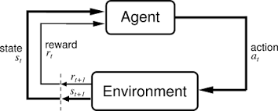

At each timestep $t$:
*  **Agents**: Receive Reward $R_t$ and Observation $O_t$, execute Action $A_t$
* **Environments**: Receive Action $A_t$, then emit Reward $R_{t+1}$ and Next Observation $O_{t+1}$ 

The sequence of observations, actions, and rewards is called history. 

$$\begin{aligned}
H_t = O_1, R_1, A_1, ... , A_{t-1}, O_t, R_t
\end{aligned}$$
 
 
**State**$(S_t)$: information used to determine what happens next. Both the agent and environment have state, and they may not agree with each other.

* **Fully observable environments**: $O_t = S_t$. The agent can know the exact state of the environment. It is called a **Markov Decision Process (MDP)**
* **Partially observable environments**: $O_t \neq S_t$. The agent only knows the partial state of the environment. It is called a **Partially Observable Markov Decision Process (POMDP)**

### Markov Decision Processes (MDP)

**Markov Decision Process (MDP)** is an environment that can be defined as a 5-tuple:

$$\begin{aligned}
(\mathcal{S}, \mathcal{A}, \mathcal{P}, \mathcal{R}, \gamma)
\end{aligned}$$

where

- $\mathcal{S}$: state space (set of states)

- $\mathcal{A}$: action space (set of actions)

- $\mathcal{P}$: state transition probability matrix $\mathcal{P}=\mathbb{P}[S_{t+1}=s'|S_t=s, A_t=a]$

- $\mathcal{R}$: reward function $\mathcal{R} = \mathbb{E}[R_{t+1}|S_t=s, A_t=a]$

- $\gamma$: discount factor $\gamma \in [0, 1]$

#### Markov Property

$$\begin{aligned}
\mathbb{P}[S_{t+1}|S_t] = \mathbb{P}[S_{t+1}|S_1, S_2, ... , S_t]
\end{aligned}$$

#### Policy

$$\begin{aligned}
\pi(a|s) = \mathbb{P}[A_{t} = a|S_t = s]
\end{aligned}$$

#### Return

$$\begin{aligned}
G_t = R_{t+1} + \gamma R_{t+2} + \gamma^2 R_{t+3} \cdots  = \sum_{k=0}^\infty \gamma^k R_{t+k+1}
\end{aligned}$$

where $\gamma \in [0, 1]$

#### Value function & Action-value function (Q-value function)

$$\begin{aligned}
v_\pi(s) = \mathbb{E_\pi}[G_t|S_t = s]
\end{aligned}$$

$$\begin{aligned}
q_\pi(s, a) = \mathbb{E_\pi}[G_t|S_t = s, A_t = a]
\end{aligned}$$

#### Bellman equation

Let's derive the Bellman expectation equation for $v_\pi(s)$.

$$
\begin{aligned}
v_{\pi}(s) &= \mathbb{E_\pi}[G_t \mid S_t = s]  \\\
        &= \mathbb{E_\pi} \left[\sum_{k=0}^\infty \gamma^k R_{t+k+1} \mid S_t = s \right]  \\\
        &= \mathbb{E_\pi} \left[R_{t+1} + \gamma \sum_{k=0}^\infty \gamma^k R_{t+k+2} \mid S_t = s \right]  \\\
        &= \mathbb{E_\pi} \left[R_{t+1} + \gamma v_\pi(s_{t+1}) \mid S_t = s \right]
\end{aligned}
$$

$$
\begin{aligned}
q_\pi(s, a) &= \mathbb{E_\pi}[R_{t+1} + \gamma q_\pi (S_{t+1}, A_{t+1}) \mid S_t = s, A_t = a]
\end{aligned}
$$

#### Optimal value functions

$$\begin{aligned}
\pi \geq \pi' \text{  iff  } v_\pi (s) \geq v_{\pi'} (s) \text{  for  } \forall s \in \mathcal{S}
\end{aligned}$$

$$\begin{aligned}
v_*(s) = \max_{\pi} v_\pi (s)
\end{aligned}$$

$$\begin{aligned}
q_*(s, a) = \max_{\pi} q_\pi (s, a)
\end{aligned}$$

for all $s \in \mathcal{S}$ and $a \in \mathcal{A}$.

$$\begin{aligned}
v_\ast(s) = \max_{a} q_\ast (s, a)
\end{aligned}$$

$$\begin{aligned}
v_\ast(s) = \mathbb{E_\pi}[R_{t+1} + \gamma v_\ast (S_{t+1})|S_t = s]
\end{aligned}$$

$$\begin{aligned}
q_*(s, a) = \mathbb{E_\pi}[R_{t+1} + \gamma \max_{a'} q_\ast (S_{t+1}, a')|S_t = s, A_t = a]
\end{aligned}$$

## Dynamic Programming

### What is Dynamic Programming?

**Dynamic programming (DP)**: a collection of algorithms that can be used to compute optimal **policies** given a perfect model such as a **Markov Decision Process (MDP).**

DP can solve problems that have two properties:

1. **Overlapping subproblems**
    * Problem can be broken down into subproblems 
    * Solutions to subproblems can be reused
2. **Optimal substructure**
    * Problem can be decomposed into subproblems

### Policy Iteration

 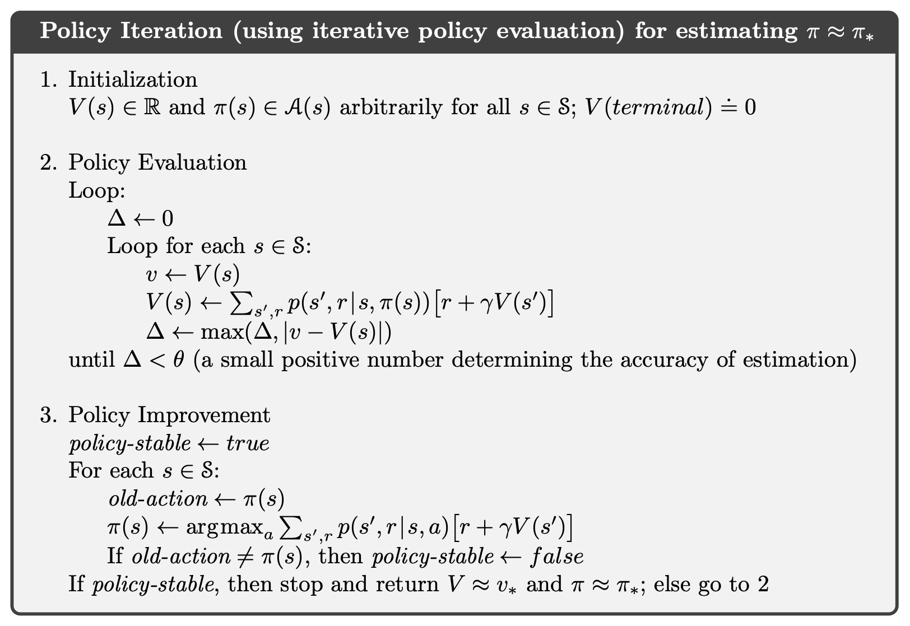

### Value Iteration

 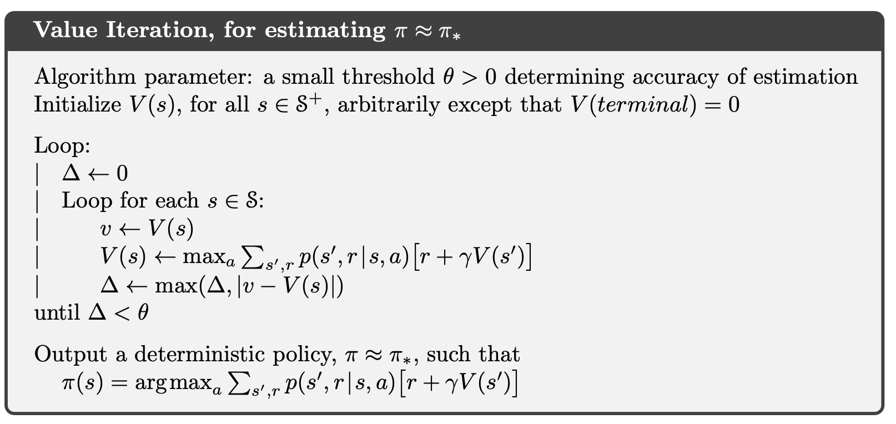

## Model-Free Prediction
 **Model-free prediction** algorithms aim to estimate the **value function of a certain policy** *without knowing the MDP*.

### Monte-Carlo Prediction

 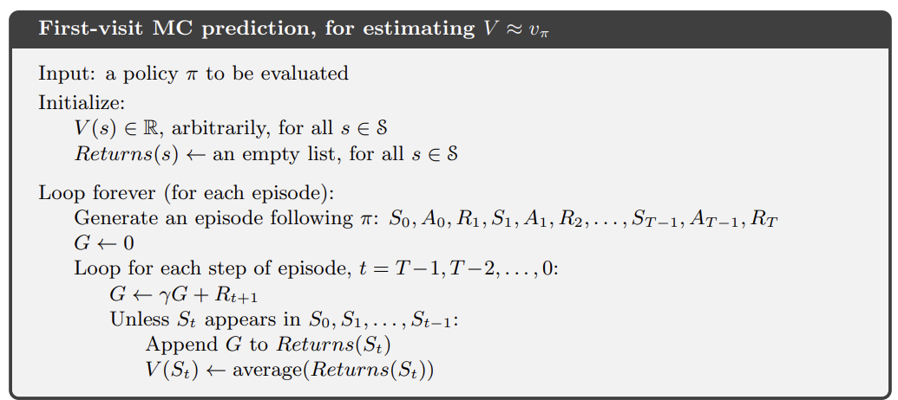

### Temporal-Difference Learning

 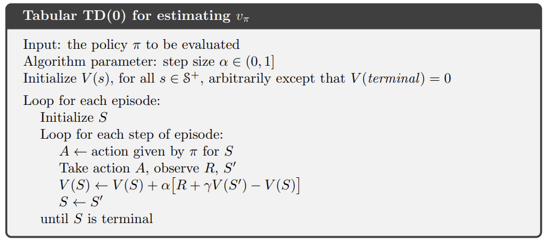

### Difference between Monte-Carlo (MC) and Temporal-Difference (TD) 

 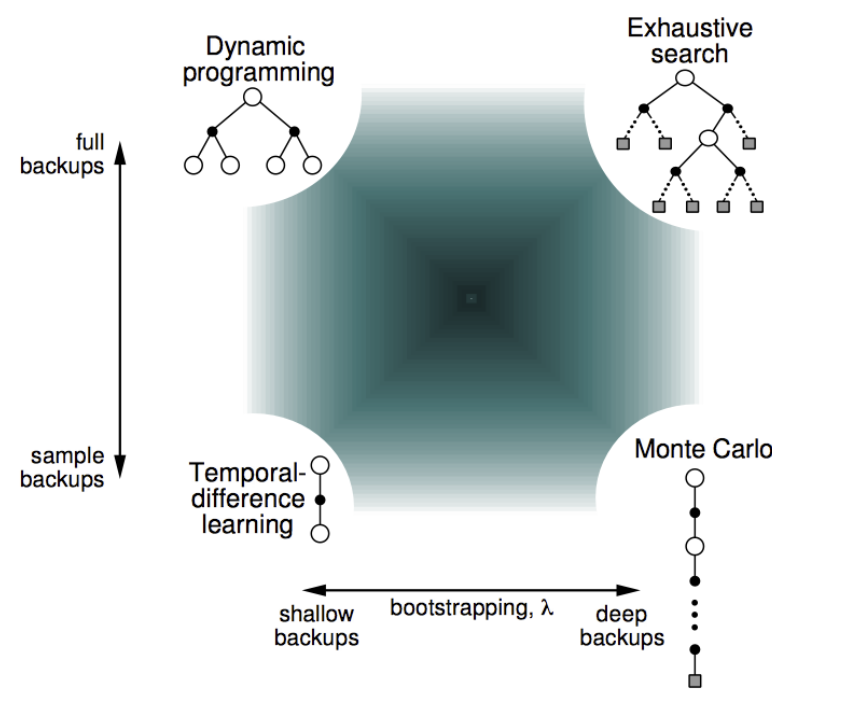

## Model-Free Control

Model-free control algorithms can be divided into two groups: on-policy control and off-policy control.

- **On-policy control**: Learn about policy $\pi$ from experience sampled from $\pi$

- **Off-policy control**: Learn about policy $\pi$ from experience sampled from policy $\mu \neq \pi$ 

Both types of control algorithms are widely utilized in RL.

### On-policy Monte-Carlo Control

 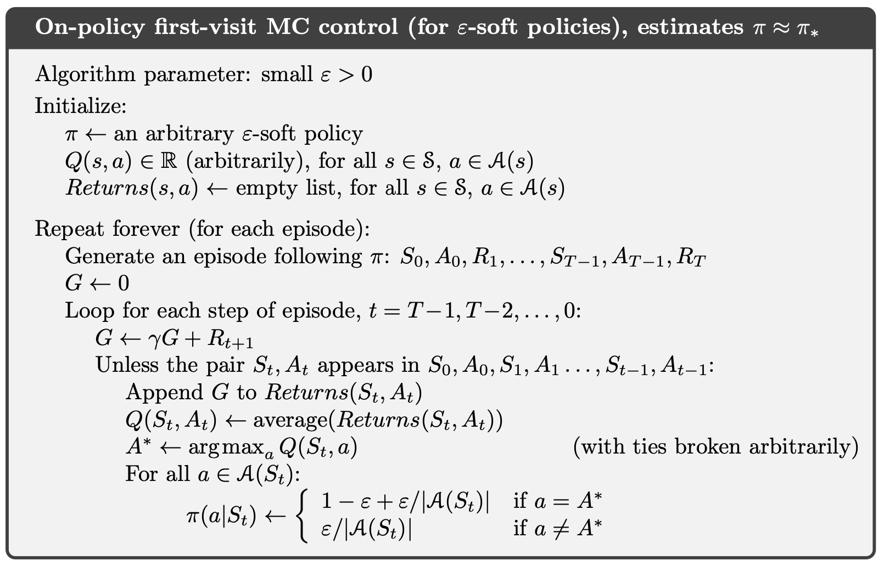

### On-policy Temporal-Difference Control 

 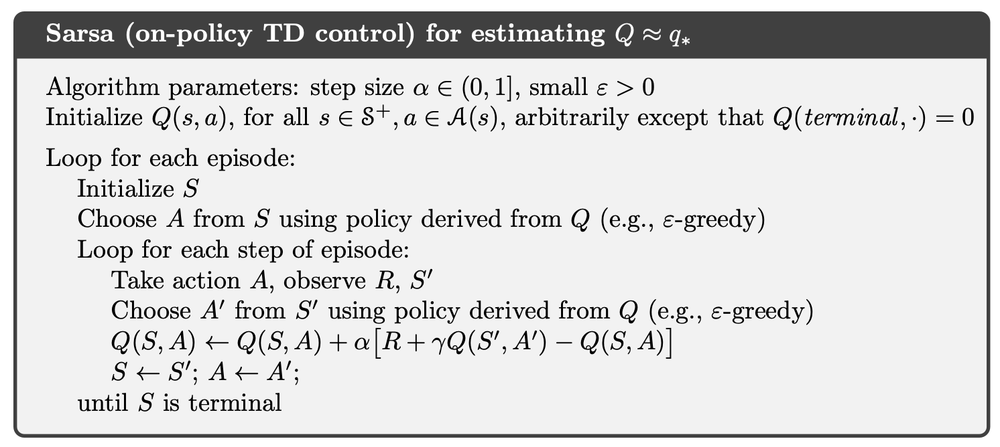

### Off-policy Temporal-Difference Control

 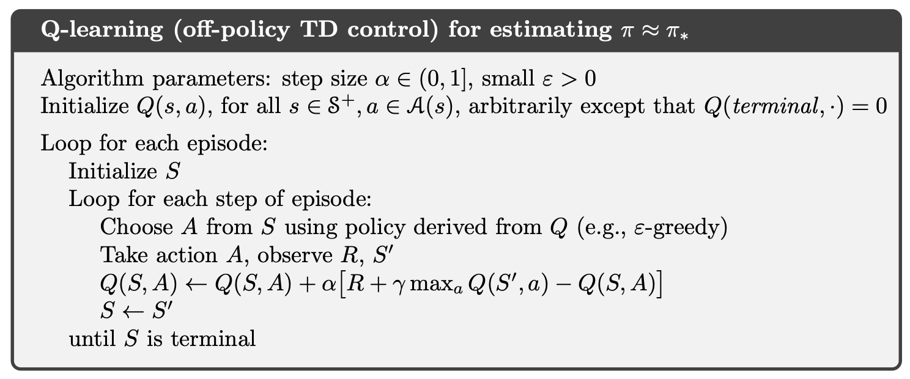

## Policy Gradient Methods

In policy gradient, policy parameter $\theta$ is updated by some scalar performance measure $\mathcal{J}(\theta)$ with respect to the policy parameter. To maximize policy performance, their updates approximate **gradient ascent** in $\mathcal{J}$:

$$\begin{align}
\theta_{t+1} = \theta_t + \alpha \nabla \mathcal{J}(\theta_t)
\end{align}$$

where $\alpha$ is a step-size parameter.

Then what can be the performance measure $\mathcal{J}(\theta)$ for an MDP policy in finite episodes?

In the episodic case, we have trajectory $\tau$. Then, we can define $\mathcal{J}(\theta)$ as its value.

$$\begin{align}
\mathcal{J}(\theta) = \sum_{s \in \mathcal{S}} d^\pi(s)v_\pi(s) = \sum_{s \in \mathcal{S}} d^\pi(s) \sum_{a \in \mathcal{A}} \pi_\theta(a|s) q_\pi(s, a)
\end{align}$$

where $d^\pi$ is the stationary distribution for the Markov chain for $\pi_\theta$.

Then the gradient of $\mathcal{J}$ can be reformatted as the following:

$$\begin{aligned}
\nabla_\theta \mathcal{J}(\theta) &= \nabla_\theta \sum_{s \in \mathcal{S}} d^\pi(s) \sum_{a \in \mathcal{A}} \pi_\theta(a|s) Q_\pi(s, a) & \\\
&\propto \sum_{s \in \mathcal{S}} d^\pi(s) \sum_{a \in \mathcal{A}} Q_\pi(s, a) \nabla_\theta \pi_\theta(a|s) \\\
 &= \sum_{s \in \mathcal{S}} d^\pi(s) \sum_{a \in \mathcal{A}} \pi_\theta(s, a) Q_\pi(s, a) \dfrac{\nabla_\theta \pi_\theta(a|s)}{\pi_\theta(a|s)} \\\ 
&= \mathbb{E_\pi} [Q_\pi(s,a) \nabla_\theta \log \pi_\theta(s,a)]
\end{aligned}$$

where $\mathbb{E_\pi}$ refers to $\mathbb{E_{s \sim d_\pi, a \sim \pi_\theta}}$ and $Q_\pi$ means the **true state-value** under policy $\pi$. 

### Policy Based Reinforcement Learning
RL algorithms that directly generate the policy from experience: **Policy-based RL**.

### Monte-Carlo Policy Gradient
$$\begin{align}
\mathbb{E_\pi} [G_t|s_t, a_t] = Q_\pi (s_t, a_t)
\end{align}$$

 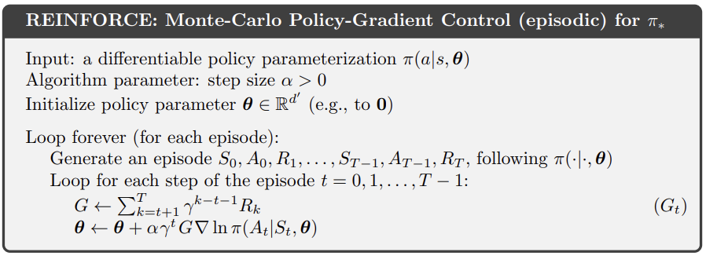

### Actor-Critic Policy Gradient

Yet the algorithm **REINFORCE** has a disadvantage of high gradient variance. 

Thus, to reduce variance, a **critic** can be used instead of **return** to estimate $Q_\pi$.

$$\begin{align}
q_\phi (s, a) = Q_\pi(s, a)
\end{align}$$

Therefore, the policy gradient is changed as

$$\begin{align}
\nabla_\theta \mathcal{J}(\theta) = \mathbb{E_\pi} [q_\phi(s,a) \nabla_\theta \log \pi_\theta(s,a)]\\
\theta \leftarrow \theta + \alpha \nabla_\theta \log \pi_\theta (a_t|s_t) q_\phi(s_t, a_t)
\end{align}$$

Critic can be updated by 

- Monte-Carlo evaluation
- TD(0)
- TD($\lambda$)

For example, if we use TD(0), then in timestep $t$ the critic will be updated as

$$\begin{align}
\phi \leftarrow \phi + \beta (r_t + \gamma q_\phi(s_{t+1}, a_{t+1}) - q_\phi(s_t, a_t)) \nabla_\phi q_\phi(s_t, a_t)
\end{align}$$

 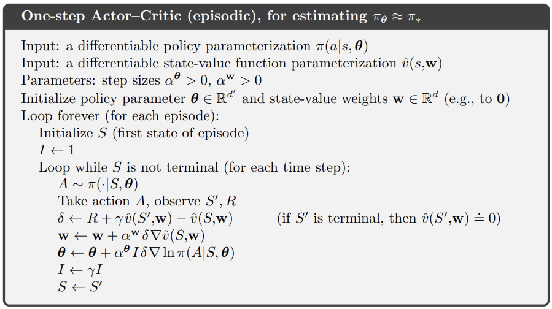

## Model-based Reinforcement Learning
 **Model-based RL**: it learns a model from experience and plans value function and/or policy from the model.

### What is a Model?

A *Model* $\mathcal{M}$ is a representation of an MDP <$\mathcal{S}, \mathcal{A}, \mathcal{P}, \mathcal{R}$> parametrized by $\eta$. Assuming we know the state space $\mathcal{S}$ and action space $\mathcal{A}$, a model $<\mathcal{P}, \mathcal{R}>$ can represent transitions

$$\begin{align}
S_{t+1} \sim \mathcal{P_\eta(S_{t+1}|S_t, A_t)} \\\
R_{t+1} \sim \mathcal{R_\eta(R_{t+1}|S_t, A_t)}
\end{align}$$

The model $<\mathcal{P}, \mathcal{R}>$ is learned from experience ${S_1, A_1, R_2, ... , S_T}$.

A model can be parametrized in various ways: from lookup table models to deep neural networks.

 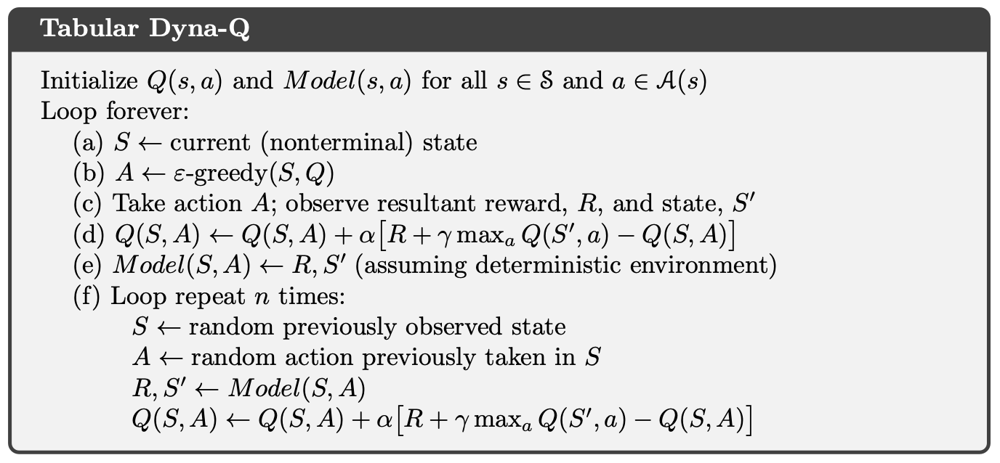

