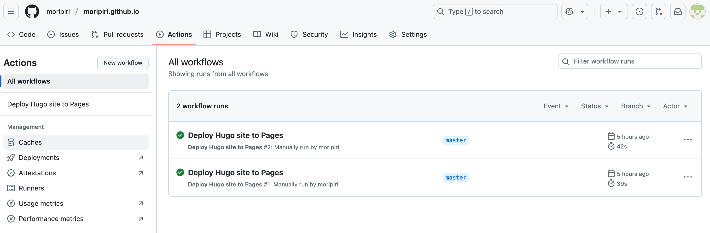

## Hugo 

블로그를 만들고 싶어 내가 몇 년 동안 많이 읽었던 [Lilian Weng's Blog](https://lilianweng.github.io/) 를 참고하기로 했다.
<!--more-->
그래서 먼저 [Hugo](https://gohugo.io) 를 설치하고 [PaperMod](https://themes.gohugo.io/themes/hugo-papermod/) 를 찾아놓았다. 

### Hugo 설치 & Create New Project
설치 가이드로 [PaperMod installation guide](https://github.com/adityatelange/hugo-PaperMod/wiki/Installation)를 참고했다.

```bash
brew install hugo --format yaml
hugo new site mori-blog
cd mori-blog
git init
git submodule add --depth=1 https://github.com/adityatelange/hugo-PaperMod.git themes/PaperMod
git submodule update --init --recursive 
echo "theme = 'PaperMod'" >> hugo.toml
hugo server
```

### `hugo.yaml` 세팅

`hugo.yml` 세팅으론 **PaperMod**가 주는 걸 참고했다.

```yaml
baseURL: "https://examplesite.com/"
title: ExampleSite
paginate: 5
theme: PaperMod

enableRobotsTXT: true
buildDrafts: false
buildFuture: false
buildExpired: false

minify:
  disableXML: true
  minifyOutput: true

params:
  env: production # to enable google analytics, opengraph, twitter-cards and schema.
  title: ExampleSite
  description: "ExampleSite description"
  keywords: [Blog, Portfolio, PaperMod]
  author: Me
  # author: ["Me", "You"] # multiple authors
  images: ["<link or path of image for opengraph, twitter-cards>"]
  DateFormat: "January 2, 2006"
  defaultTheme: auto # dark, light
  disableThemeToggle: false

  ShowReadingTime: true
  ShowShareButtons: true
  ShowPostNavLinks: true
  ShowBreadCrumbs: true
  ShowCodeCopyButtons: false
  ShowWordCount: true
  ShowRssButtonInSectionTermList: true
  UseHugoToc: true
  disableSpecial1stPost: false
  disableScrollToTop: false
  comments: false
  hidemeta: false
  hideSummary: false
  showtoc: false
  tocopen: false

  assets:
    # disableHLJS: true # to disable highlight.js
    # disableFingerprinting: true
    favicon: "<link / abs url>"
    favicon16x16: "<link / abs url>"
    favicon32x32: "<link / abs url>"
    apple_touch_icon: "<link / abs url>"
    safari_pinned_tab: "<link / abs url>"

  label:
    text: "Home"
    icon: /apple-touch-icon.png
    iconHeight: 35

  # profile-mode
  profileMode:
    enabled: false # needs to be explicitly set
    title: ExampleSite
    subtitle: "This is subtitle"
    imageUrl: ""
    imageWidth: 120
    imageHeight: 120
    imageTitle: my image
    buttons:
      - name: Posts
        url: posts
      - name: Tags
        url: tags

  # home-info mode
  homeInfoParams:
    Title: "Hi there \U0001F44B"
    Content: Welcome to my blog

  socialIcons:
    - name: x
      url: "https://x.com/"
    - name: stackoverflow
      url: "https://stackoverflow.com"
    - name: github
      url: "https://github.com/"

  analytics:
    google:
      SiteVerificationTag: "XYZabc"
    bing:
      SiteVerificationTag: "XYZabc"
    yandex:
      SiteVerificationTag: "XYZabc"

  cover:
    hidden: true # hide everywhere but not in structured data
    hiddenInList: true # hide on list pages and home
    hiddenInSingle: true # hide on single page

  editPost:
    URL: "https://github.com/<path_to_repo>/content"
    Text: "Suggest Changes" # edit text
    appendFilePath: true # to append file path to Edit link

  # for search
  # https://fusejs.io/api/options.html
  fuseOpts:
    isCaseSensitive: false
    shouldSort: true
    location: 0
    distance: 1000
    threshold: 0.4
    minMatchCharLength: 0
    limit: 10 # refer: https://www.fusejs.io/api/methods.html#search
    keys: ["title", "permalink", "summary", "content"]
menu:
  main:
    - identifier: categories
      name: categories
      url: /categories/
      weight: 10
    - identifier: tags
      name: tags
      url: /tags/
      weight: 20
    - identifier: example
      name: example.org
      url: https://example.org
      weight: 30
# Read: https://github.com/adityatelange/hugo-PaperMod/wiki/FAQs#using-hugos-syntax-highlighter-chroma
pygmentsUseClasses: true
markup:
  highlight:
    noClasses: false
    # anchorLineNos: true
    # codeFences: true
    # guessSyntax: true
    # lineNos: true
    # style: monokai
```
개인적인 것만 바꾸면 세팅 완료이다.

### 기본 포스트 형식 세팅

`archetypes/post.md`를 다음과 같이 만들었다.

```yaml
---
title: "My 1st post"
date: 2020-09-15T11:30:03+00:00
# weight: 1
# aliases: ["/first"]
tags: ["first"]
author: "Me"
# author: ["Me", "You"] # multiple authors
showToc: true
TocOpen: false
draft: false
hidemeta: false
comments: false
description: "Desc Text."
canonicalURL: "https://canonical.url/to/page"
disableShare: false
disableHLJS: false
hideSummary: false
searchHidden: true
ShowReadingTime: true
ShowBreadCrumbs: true
ShowPostNavLinks: true
ShowWordCount: true
ShowRssButtonInSectionTermList: true
UseHugoToc: true
cover:
    image: "<image path/url>" # image path/url
    alt: "<alt text>" # alt text
    caption: "<text>" # display caption under cover
    relative: false # when using page bundles set this to true
    hidden: true # only hide on current single page
editPost:
    URL: "https://github.com/<path_to_repo>/content"
    Text: "Suggest Changes" # edit text
    appendFilePath: true # to append file path to Edit link
---
```

이 형식으로 post를 만들려면 다음을 사용하면 된다.
```bash
hugo new --kind post <name>
```

### Github Pages에 deploy하기
믿음의 Github Pages를 사용해서 deploy하기로 했는데, Hugo는 [`Github Actions`](https://gohugo.io/host-and-deploy/host-on-github-pages/)를 사용하는 걸 추천해서 이걸 사용했다. 
가이드 대로 github actions를 설정해주면 끝.




그럼 완료이다.


