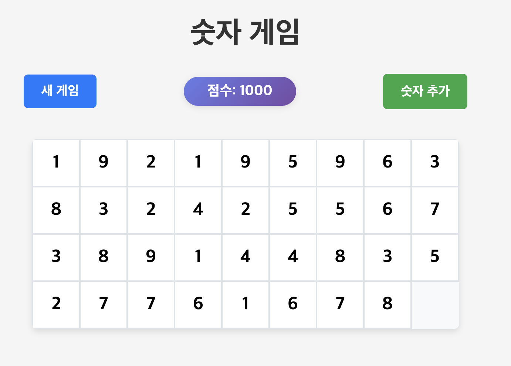
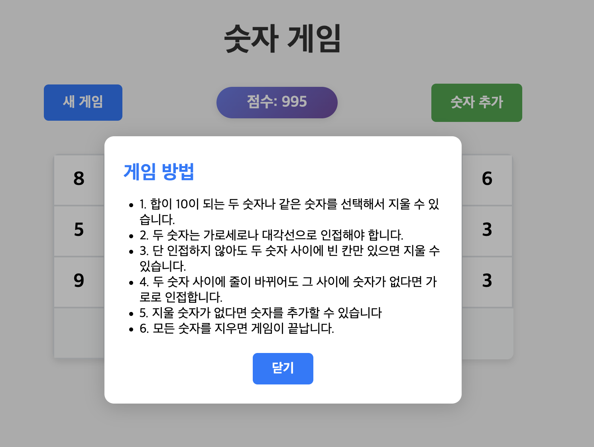
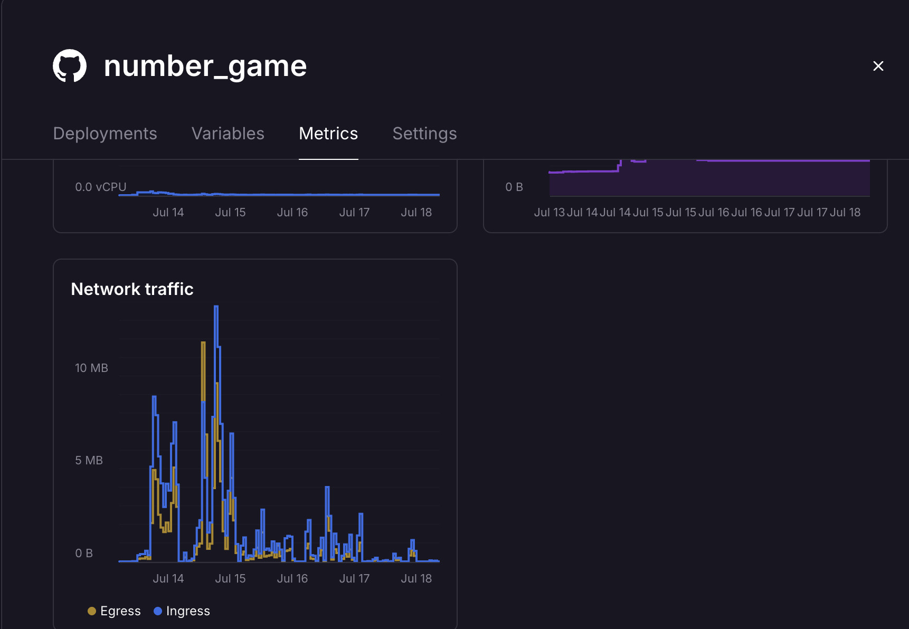

## Number Game: 바이브 코딩으로 만든 숫자 퍼즐 게임
<!--more-->

폰으로 게임하다 광고에 지쳐 차라리 내가 직접 만들고 싶어졌기에 Cursor를 이용하여 빠르게 개발해 보았다.

링크: https://number-game-rose.vercel.app/

<p align="center">
 
</p>

<p align="center">
 
</p>


아래는 AI가 적어 준 프로젝트 요약이다.

### 🎮 프로젝트 개요 (AI 작성)

Number Game은 합이 10이 되는 숫자들을 매칭하여 제거하는 퍼즐 게임입니다. React 프론트엔드와 FastAPI 백엔드로 구성된 풀스택 웹 애플리케이션으로, LocalStorage를 활용한 상태 관리와 다양한 애니메이션 효과를 특징으로 합니다.

### 🏗️ 전체 아키텍처

```
┌─────────────────┐    HTTP API    ┌─────────────────┐
│  React Frontend │ ◄────────────► │ FastAPI Backend │
│                 │                │                 │
│ • Game UI       │                │ • Game Logic    │
│ • State Mgmt    │                │ • Board Creation│
│ • Animations    │                │ • Validation    │
│ • LocalStorage  │                │ • Stateless     │
└─────────────────┘                └─────────────────┘
```

### 📁 프로젝트 구조

```
number_game/
├── frontend/                 # React 애플리케이션
│   ├── src/
│   │   ├── App.jsx          # 메인 컴포넌트
│   │   ├── components/      # UI 컴포넌트들
│   │   │   ├── Board.jsx    # 게임 보드
│   │   │   ├── NumberCell.jsx # 개별 숫자 셀
│   │   │   └── Controls.jsx # 게임 컨트롤
│   │   ├── api/
│   │   │   └── gameApi.js   # API 통신
│   │   └── utils/
│   │       └── soundEffects.js # 사운드 효과
│   └── package.json
├── backend/                  # FastAPI 서버
│   ├── app/
│   │   ├── main.py          # API 엔드포인트
│   │   ├── game_logic.py    # 게임 규칙 로직
│   │   └── models.py        # 데이터 모델
│   └── requirements.txt
└── README.md
```

### 🎯 핵심 기술 스택

#### Frontend
- **React 18.2.0**: 컴포넌트 기반 UI
- **CSS**: 스타일링 및 애니메이션
- **LocalStorage**: 게임 상태 영속성

#### Backend
- **FastAPI**: 고성능 Python 웹 프레임워크
- **Pydantic**: 데이터 검증 및 직렬화
- **Uvicorn**: ASGI 서버

### 🔧 핵심 기능 분석

1. 게임 로직 (Backend)

1.1. 보드 생성 알고리즘

- 게임 보드는 1부터 9까지의 숫자가 각각 최소 두 번씩 포함되도록 만듭니다.
- 여기에 추가로 17개의 숫자를 1부터 9 사이에서 무작위로 뽑아 더합니다.
- 이렇게 모은 숫자들을 3행 9열, 그리고 1행 8열로 나누어 배열하여 게임 보드를 완성합니다.

1.2. 매칭 검증 로직

- 두 개의 셀을 선택했을 때, 두 숫자가 같거나 두 숫자의 합이 10이 되는 경우에만 제거가 가능합니다.
- 단순히 숫자 조건만 맞으면 되는 것이 아니라, 두 셀이 인접해 있거나, 두 셀 사이에 막힌 부분 없이 연결될 수 있어야 합니다.

2. 상태 관리 (Frontend)

2.1. LocalStorage 기반 영속성

- 게임의 상태는 브라우저의 LocalStorage에 저장됩니다.
- 게임을 시작할 때 LocalStorage에 저장된 상태가 있으면 그 상태를 불러오고, 없으면 새 게임을 시작합니다.
- 게임이 진행될 때마다 현재 상태를 LocalStorage에 저장하여, 새로고침해도 이어서 플레이할 수 있습니다.

2.2. 컴포넌트 상태 관리

- React의 상태 관리 기능을 사용하여 게임 상태, 선택된 셀, 로딩 여부, 사운드 설정 등을 관리합니다.
- 각각의 상태는 별도의 변수로 관리되어, UI가 효율적으로 업데이트됩니다.

3. 애니메이션 시스템

3.1. CSS 애니메이션

- 셀이 흔들리거나 사라지는 등 다양한 애니메이션 효과를 CSS 클래스로 구현합니다.
- 예를 들어, 잘못된 선택을 하면 흔들림(shake) 효과, 셀이 제거될 때는 사라짐(fade-out) 효과가 적용됩니다.

3.2. 애니메이션 상태 관리

- 어떤 셀에 어떤 애니메이션을 적용할지 React 상태로 관리합니다.
- 예를 들어, 흔들릴 셀, 제거된 셀, 성공적으로 매칭된 셀, 새로 추가된 셀 등을 각각 따로 관리합니다.

4. 사운드 시스템

4.1. Web Audio API 활용

- 사운드 효과는 Web Audio API를 사용해 직접 생성합니다.
- 클릭, 성공, 실패, 승리 등 다양한 상황에 맞는 사운드가 준비되어 있습니다.
- 사운드는 필요에 따라 켜거나 끌 수 있습니다.

5. 🔄 데이터 플로우

5.1. 게임 시작
```
1. React App 마운트
2. LocalStorage에서 저장된 상태 확인
3. 저장된 상태가 있으면 복원, 없으면 새 게임 시작
4. FastAPI /start 엔드포인트 호출
5. 초기 보드 생성 및 반환
6. 게임 상태를 LocalStorage에 저장
```

5.2. 숫자 제거
```
1. 사용자가 두 셀 선택
2. 선택된 셀들의 유효성 검사
3. FastAPI /remove 엔드포인트 호출
4. 백엔드에서 매칭 규칙 검증
5. 성공 시 보드 업데이트, 실패 시 에러 애니메이션
6. 업데이트된 상태를 LocalStorage에 저장
```

5.3. 숫자 추가
```
1. 사용자가 "Add Numbers" 버튼 클릭
2. FastAPI /add 엔드포인트 호출
3. 백엔드에서 새로운 숫자들 생성
4. 보드에 새 숫자들 추가
5. 애니메이션 효과와 함께 UI 업데이트
```

6. 🎨 UI/UX 설계

6.1. 컴포넌트 계층 구조
```
App
├── Board
│   └── NumberCell (여러 개)
├── Controls
└── HowToPlayModal
```

6.2. 반응형 디자인
- CSS Grid를 활용한 유연한 보드 레이아웃
- 모바일 친화적인 터치 인터페이스
- 다양한 화면 크기에 대응하는 반응형 디자인

#### 접근성 고려사항
- 키보드 네비게이션 지원
- 스크린 리더 호환성
- 색상 대비 및 가독성 최적화

### 🚀 성능 최적화

#### 1. 메모리 관리
- 불필요한 리렌더링 방지를 위한 React.memo 활용
- 애니메이션 상태의 적절한 정리
- LocalStorage 사용량 최적화

#### 2. 네트워크 최적화
- Stateless 백엔드 설계로 서버 리소스 절약
- 필요한 데이터만 전송하는 효율적인 API 설계
- 에러 처리 및 재시도 로직

#### 3. 사용자 경험
- 로딩 상태 표시
- 즉각적인 피드백 (애니메이션, 사운드)
- 게임 상태 자동 저장

### 🔒 보안 고려사항

#### 1. 입력 검증
- 프론트엔드와 백엔드 양쪽에서 유효성 검사
- XSS 공격 방지를 위한 데이터 이스케이핑
- API 요청의 적절한 검증

#### 2. 데이터 보호
- 민감한 정보는 서버에 저장하지 않음
- LocalStorage 사용 시 데이터 무결성 확인
- 클라이언트 사이드 보안 고려사항

### 📊 확장 가능성

#### 1. 기능 확장
- 멀티플레이어 지원
- 리더보드 시스템
- 다양한 게임 모드
- 난이도 조절

#### 2. 기술적 확장
- WebSocket을 통한 실시간 기능
- PWA(Progressive Web App) 지원
- 오프라인 플레이 기능
- 데이터베이스 연동

### 🎯 개발 철학

#### 1. 단순함 (Simplicity)
- 복잡한 상태 관리 라이브러리 대신 React 기본 기능 활용
- 명확하고 이해하기 쉬운 코드 구조
- 최소한의 의존성

#### 2. 사용자 중심 (User-Centric)
- 직관적인 게임 인터페이스
- 즉각적인 피드백과 애니메이션
- 게임 상태의 자동 저장

#### 3. 성능 최적화 (Performance)
- 효율적인 렌더링
- 최적화된 애니메이션
- 빠른 응답 시간

### 📝 결론

Number Game은 현대적인 웹 개발 기술을 활용하여 만든 완성도 높은 퍼즐 게임입니다. React와 FastAPI의 조합으로 성능과 개발 경험을 모두 만족시키는 아키텍처를 구축했으며, LocalStorage를 활용한 상태 관리와 다양한 애니메이션 효과로 사용자에게 매력적인 게임 경험을 제공합니다.

이 프로젝트는 작은 규모이지만 확장 가능한 구조를 가지고 있어, 향후 다양한 기능 추가나 개선이 용이한 설계를 보여줍니다.


---

### 인간의 후기


1. 명확한 목표 설정의 중요성

- **프롬프트는 나침반**  
  바이브 코딩은 빠른 피드백과 반복이 핵심이기 때문에, "무엇을 만들고 싶은가?"에 대한 명확한 프롬프트가 없다면 개발이 산으로 가기 쉽습니다.  
  예를 들어,  
  > "숫자 맞추기 게임에서 사용자가 입력한 숫자에 따라 즉각적으로 피드백을 주자."  
  이런 식의 구체적인 프롬프트가 있으면, 구현해야 할 기능이 명확해지고, 코드 작성과 테스트가 훨씬 수월해집니다.

2. 실시간 피드백과 프롬프트의 반복

- **작게 쪼개고, 바로바로 확인**  
  바이브 코딩에서는 "한 번에 완벽하게"가 아니라,  
  > "일단 입력창만 만들자."  
  > "이제 입력값을 콘솔에 찍어보자."  
  > "정답과 비교해서 결과를 보여주자."  
  처럼 작은 단위의 프롬프트를 계속 던지며, 그때그때 결과를 확인하고 다음 단계를 정하는 게 더 효율적이었습니다.

3. 기본 프롬프트 세팅의 중요성

바이브 코딩을 처음 해보면서 일부러 아무런 세팅도 하지 않고 해보았는데, AI의 의도 이해 미숙이나 내용 변경을 너무 자주 겪으면서 오히려 기본 세팅의 중요성을 깨닫게 되었다. 

- **초기 세팅이 곧 생산성**  
  바이브 코딩을 시작할 때, "기본 프롬프트"를 잘 세팅해두는 것이 매우 중요합니다.  
  예를 들어,  
  > "이 프로젝트의 목적은 무엇인가?"  
  > "사용자 경험에서 가장 중요한 포인트는?"  
  > "프론트엔드와 백엔드의 역할 분담은?"  
  등 핵심 질문을 미리 정리해두면, AI와의 대화가 산만해지지 않고 일관성을 유지할 수 있습니다.

- **반복되는 설명을 줄여줌**  
  프로젝트의 컨텍스트(예: 사용 기술, 디자인 원칙, 주요 기능 등)를 프롬프트에 미리 포함시켜두면,  
  매번 같은 설명을 반복하지 않아도 되고, AI가 더 정확한 답변을 내놓는 데 도움이 됩니다.


<p align="center">
 
</p>

어쨌든 코드 작성부터 배포까지 AI의 도움을 받은 이 게임은 한 일주일 동안 주변인들에게 꽤 인기를 얻었고,  [Railway](https://railway.com/)가 주는 공짜 5달러 중 한 0.1달러는 쓸 수 있었다.


